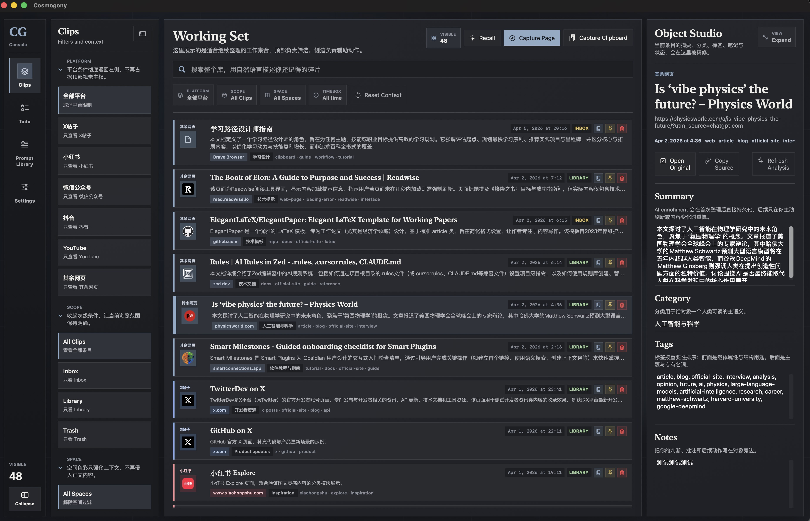
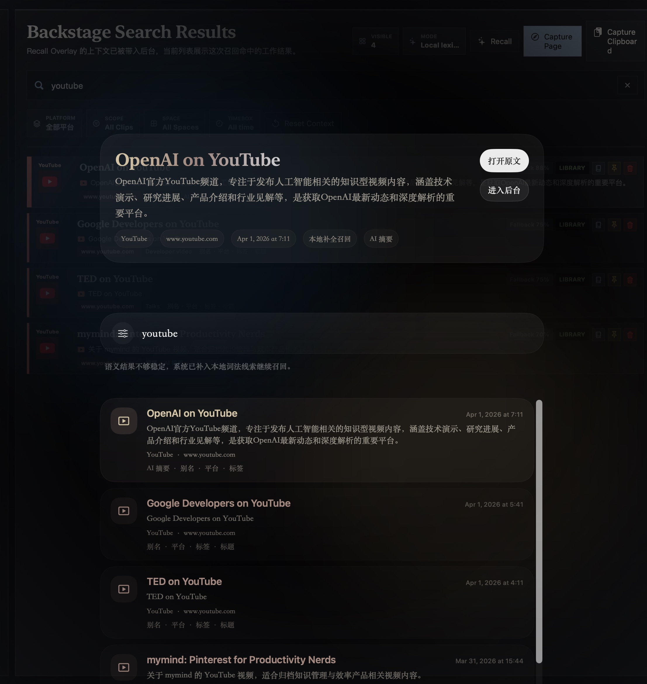
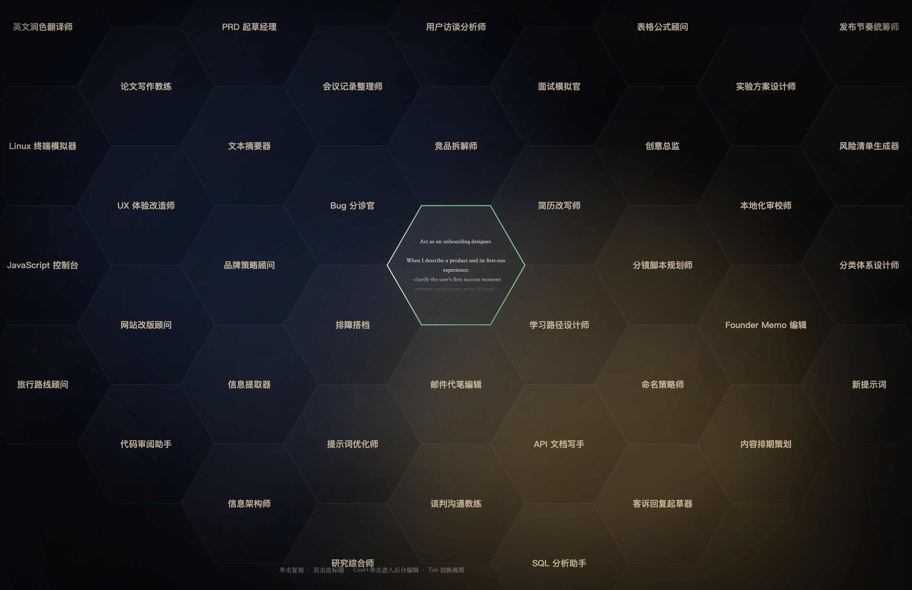

# Cosmogony

Cosmogony 是一个面向 macOS 的本地优先剪藏与整理工作台。

它不只是“把网页存下来”，而是把剪藏、搜索、整理、精修放进同一个 backstage 界面里，让你可以在一个地方完成这些事：

- 保存当前网页或剪贴板内容
- 按平台和状态快速筛选
- 用自然语言回忆曾经收藏过的内容
- 给每条内容补摘要、分类、标签和笔记
- 把常用提示词和待办也放进同一个工作区里管理

## 截图预览

### 1. 日常工作台

左侧是模块和筛选，中间是高密度 clips 列表，右侧是 Object Studio 编辑区。



### 2. Recall / AI 搜索

你可以直接用自然语言描述“我记得的碎片”，从本地库里回忆出相关内容。



### 3. Prompt Library

Prompt Library 用蜂巢视图展示不同角色和用途的提示词，适合做个人提示词库。



## 现在这个版本能做什么

当前 MVP 已经覆盖一整条从采集到整理的闭环：

- `Clips / Prompt Library / Todo / Settings` 四个模块已经统一进 backstage
- 支持采集当前网页
- 支持采集剪贴板文本
- 自动按平台归类：`X帖子 / 小红书 / 微信公众号 / 抖音 / YouTube / 其余网页`
- clips 列表支持高密度浏览、置顶、删除、标记已读
- 右侧 `Object Studio` 支持编辑摘要、分类、标签、笔记、状态
- 支持重复链接检测，避免重复收藏
- 支持未保存离开提醒
- 支持垃圾箱与 30 天自动清理
- 支持 Recall / AI 搜索
- 支持 Prompt Library 和 Todo 工作流
- 支持本地 Provider Profile 与 Keychain API Key
- 支持旧版 MuseMark JSON 导入导出

## Cosmogony 的使用方式

### 1. 采集内容

目前主要有两种输入方式：

1. 在浏览器里采集当前网页
2. 在桌面端直接采集剪贴板

如果是网页内容，系统会尽量保留网址、标题、摘要与正文。
如果是纯文本剪贴板，系统会把它当成一条可继续精修的 clipboard clip。

### 2. 进入 backstage 整理

进入 `Clips` 后，你会看到四层结构：

1. 最左边：模块轨
2. 第二列：筛选和上下文
3. 中间：当前 clips 列表
4. 最右边：Object Studio

这样设计的目标是让“找内容”和“改内容”同时可见，不需要来回切换页面。

### 3. 找到你要的内容

你可以用几种方式缩小范围：

- 按平台筛选
- 按 `Inbox / Library / Trash` 状态筛选
- 按空间筛选
- 按时间盒筛选
- 用自然语言搜索

比如你不一定记得标题，但记得“好像是一个讲 onboarding checklist 的 YouTube 视频”，直接搜自然语言也能把结果召回出来。

### 4. 精修每条 clip

选中一条 clip 后，右侧 `Object Studio` 可以继续补内容：

- Summary
- Category
- Tags
- Notes
- Status
- Clipboard text

这一步是 Cosmogony 和普通“收藏夹”最大的区别之一：你不是把东西扔进去就结束，而是可以把它整理成真正可再次使用的资产。

## 适合谁用

Cosmogony 现在尤其适合这些场景：

- 收藏了很多网页、但之后总是找不回来的人
- 会长期积累文章、视频、文档、帖子的人
- 需要把灵感、资料、提示词、待办放进同一个系统的人
- 想先本地优先使用，再决定是否接入模型能力的人

## 项目结构

- `apps/macos/`
  macOS 主应用，负责界面、本地数据库、快捷键、桥接服务、Provider 配置
- `extensions/chromium/`
  Companion Extension，负责把浏览器里的页面信息发送给桌面端
- `legacy/chrome-extension/`
  旧版扩展归档，仅作为迁移参考
- `docs/`
  设计与架构说明
- `tools/python/`
  Python 辅助脚本

## 技术实现，尽量用人话说明

### 本地优先

数据主要保存在本地，不依赖云端才能使用。

### 平台识别

系统会根据网址 host 自动判断来源平台，例如：

- `x.com` -> `X帖子`
- `youtube.com` -> `YouTube`
- `mp.weixin.qq.com` -> `微信公众号`

这样做的好处是，哪怕用户没有配置任何模型，也有一层稳定可用的基础分类。

### 搜索不是只看标题

每条 clip 会把这些内容一起做成搜索语料：

- 标题
- 域名
- 摘要
- 正文
- 分类
- 标签
- 笔记

如果配置了可用的模型能力，还能进一步做更自然的 Recall / AI 搜索。

### 编辑流不是“弹窗卡片”

这版 UI 的重点是把整个 backstage 做成一个连续工作台，而不是很多孤立的小卡片和弹窗。你可以一边扫列表，一边改右侧内容。

## 安装与运行

### 方式一：直接使用打包产物

打包完成后会得到这些文件：

- `apps/macos/dist/Cosmogony.app`
- `apps/macos/dist/Cosmogony.zip`
- `apps/macos/dist/Cosmogony.dmg`

如果你只是想安装测试版，优先使用 `.dmg`。

### 方式二：本地开发运行

```bash
cd apps/macos
swift build
swift run CosmogonyChecks
swift run CosmogonyApp
```

### Xcode 工程

仓库内已经带有 Xcode 工程：

- `apps/macos/Cosmogony.xcodeproj`

如果需要根据 `project.yml` 重新生成：

```bash
xcodegen generate --spec apps/macos/project.yml
```

## 打包桌面应用

```bash
bash apps/macos/scripts/package_app.sh
```

打包后可以直接打开：

```bash
open apps/macos/dist/Cosmogony.app
```

## 安装 Chromium Companion Extension

1. 打开 `chrome://extensions`
2. 打开开发者模式
3. 选择 `Load unpacked`
4. 载入 `extensions/chromium`

当前 bridge 接口包括：

- `GET /v1/health`
- `POST /v1/handshake`
- `POST /v1/captures/page`
- `POST /v1/captures/clipboard`

## Python 辅助脚本

```bash
cd tools/python
uv venv ../../.venv
uv pip install --python ../../.venv/bin/python -e .
python legacy_export_preview.py /path/to/musemark-export.json
```

## 当前设计方向

这版界面整体更偏“控制台式工作台”，而不是传统收藏应用的温和卡片风格。它参考了 `Linear`、`Arc Spaces`、`Craft` 这类产品的一些优点，但重点还是围绕“快速整理知识碎片”这个目标来做。

当前几个明确方向是：

- 尽量高密度，让一屏看见更多内容
- 左右分栏，让浏览和编辑同时发生
- 先把本地闭环做扎实，再逐步增强 AI 能力

## 当前版本说明

这个阶段已经可以视为最小可用产品：

- 剪藏闭环已经能跑通
- 搜索、整理、编辑已经连起来
- Prompt Library 和 Todo 已并入统一工作台
- 本地打包产物已经可直接分发测试

后续迭代重点会更偏向：

- 更顺手的搜索和召回体验
- 更成熟的发布包与安装体验
- 更完整的提示词和个人知识工作流
